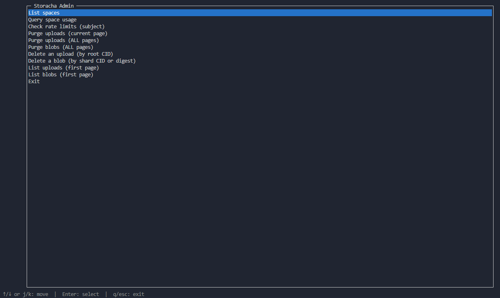

# Storacha Admin TUI

A standalone Storacha admin terminal UI with space and file management tools.



## Features

- List spaces and view space usage
- Inspect rate limits for a subject
- Browse uploads/blobs with pagination and detail view
- Remove uploads/blobs and purge uploads/blobs with safeguards

## Requirements

- Node.js 18+
- Storacha service key and access

## Install

```bash
npm install
```

## Configure

Create a `.env` file in the project root or export environment variables. These
environment variables are optional; if you do not set them, you can still log
in through the normal flow:

```
STORACHA_SERVICE_KEY=...
STORACHA_PROFILE=storacha-admin-tui
STORACHA_SERVICE_PROOF=...
STORACHA_LOGIN_EMAIL=you@example.com
STORACHA_PROVIDER_DID=did:web:...
```

## Run

```bash
npm start
```

Or install as a CLI:

```bash
npm link
storacha-admin-tui
```

## Project Layout

- `src/admin`: Storacha operations and menu flow
- `src/tui`: Blessed-based UI primitives
- `src/utils`: Formatting and digest helpers
- `src/config`: Environment and multiformats setup

## License

MIT
